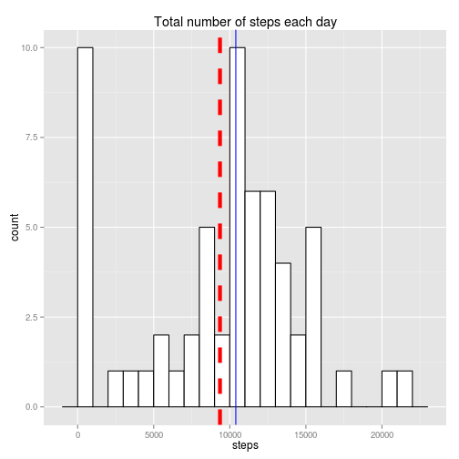
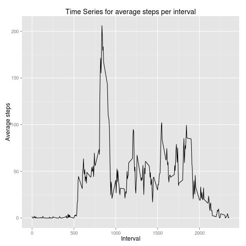
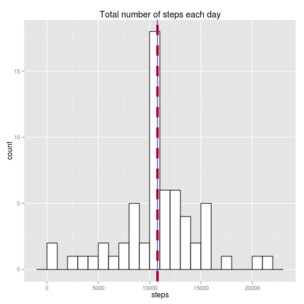
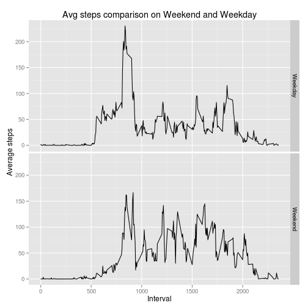

## Peer Assessment Assignment 1

================================================================

### Loading and preprocessing the data


```r
# Part 1: Load the Data
health_data = read.csv('~/activity.csv')
```

```
## Warning: cannot open file '/home/jammy/activity.csv': No such file or
## directory
```

```
## Error: cannot open the connection
```

```r
#Part 2: Transformation of Data

# Conversion into date format
health_data$date = as.Date(health_data$date)

# Calculating the number of day of each date in observation
health_data$day = as.integer(health_data$date - min(health_data$date) + 1)
```

### What is mean total number of steps taken per day?


```r
# Part 1: Creation of histogram of total number of steps taken each day

# creating new data frame with sum of steps each day
day_steps = with(health_data, aggregate(steps, list(day), FUN = sum, na.rm = TRUE))
colnames(day_steps) = c('day', 'steps')

# creation of histogram using ggplot2
library(ggplot2)
ggplot(day_steps, aes(x = steps)) + geom_histogram(binwidth = 1000, colour = 'black', fill = 'white') + ggtitle('Total number of steps each day') + geom_vline(aes(xintercept = mean(steps, na.rm = TRUE)), color = 'red', linetype = 'dashed', size = 2) + geom_vline(aes(xintercept = median(steps, na.rm = TRUE)), color = 'blue')
```

 

```r
# Part 2: Calculation of mean and median of steps taken each day

# Calulation and Reporting of mean
with(day_steps, mean(steps, na.rm = TRUE))
```

```
## [1] 9354
```

```r
# Calulation and Reporting of median
with(day_steps, median(steps, na.rm = TRUE))
```

```
## [1] 10395
```

### What is the average daily activity pattern?


```r
# Part 1: Creation of time series plot of 5 mins inverval vs average steps each day

# creating average steps per interval data frame
mins_steps = with(health_data, aggregate(steps, list(interval), FUN = mean, na.rm = TRUE))
colnames(mins_steps) = c('interval', 'steps')

# Creating Time Series plot
ggplot(mins_steps, aes(interval, steps)) + geom_line() +xlab('Interval')+ylab('Average steps')+ggtitle('Time Series for average steps per interval')
```

 

```r
# Part 2: Finding which interval has maximum steps on an average across all days

mins_steps$interval[mins_steps$steps == max(mins_steps$steps)]
```

```
## [1] 835
```


### Imputing missing values


```r
# Part 1: Find how many rows have missing values in data

sum(is.na(health_data))
```

```
## [1] 2304
```

```r
# Part 2: Strategising imputation of null values of steps by average of each interval

step_avg = with(health_data, tapply(steps, interval, mean, na.rm = TRUE))

# Part 3: Creating a new df with replacement of null values

health_impute = transform(health_data, steps = ifelse(is.na(steps), step_avg, steps))

# Part 4: Creation of histogram from part 1 on new data set

# Aggregating steps on each day
day_steps_imp = with(health_impute, aggregate(steps, list(day), FUN = sum, na.rm = TRUE))
colnames(day_steps_imp) = c('day', 'steps')


# Creating final histogram
ggplot(day_steps_imp, aes(x = steps)) + geom_histogram(binwidth = 1000, colour = 'black', fill = 'white') + ggtitle('Total number of steps each day') + geom_vline(aes(xintercept = mean(steps, na.rm = TRUE)), color = 'red', linetype = 'dashed', size = 2) + geom_vline(aes(xintercept = median(steps, na.rm = TRUE)), color = 'blue')
```

 

```r
# Calulation and Reporting of mean
with(day_steps_imp, mean(steps, na.rm = TRUE))
```

```
## [1] 10766
```

```r
# Calulation and Reporting of median
with(day_steps_imp, median(steps, na.rm = TRUE))
```

```
## [1] 10766
```

Following are the impacts of imputation:

-- Both mean and median have increased  
-- Increase in mean is larger than increase in median  
-- Large peak in first histogram due to missing values is gone

  
### Are there differences in activity patterns between weekdays and weekends?


```r
# Part 1: Creation of new factor variable for Weekend and Weekday

health_impute$weekday = as.factor(ifelse(weekdays(health_impute$date) %in% c('Saturday', 'Sunday'), 'Weekend', 'Weekday'))

# Part 2: Comparison of average steps taken on Weekend and Weekday

# Creating data frame with average steps per interval over weekend and weekday
week_steps = with(health_impute, aggregate(steps, list(interval, weekday), mean))
colnames(week_steps) = c('interval', 'weekday', 'steps')

# Plotting seperate time series for Weekend and Weekday
ggplot(week_steps, aes(interval, steps)) + geom_line() + facet_grid(weekday ~ .) + xlab('Interval')+ylab('Average steps')+ggtitle('Avg steps comparison on Weekend and Weekday')
```

 
